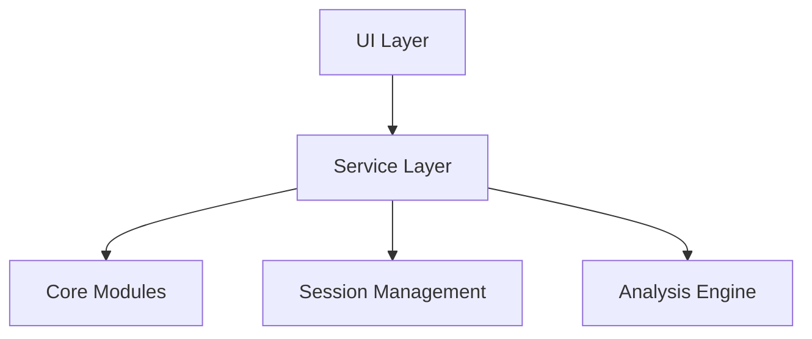

# Slot Game Analyzer

A Python application for analyzing slot game patterns and behaviors using a modular, service-oriented architecture.

## Architecture



## Core Components

- **Service Layer**: Modular business logic implementation
- **Configuration Management**: Environment-based settings using Pydantic
- **Error Handling**: Comprehensive error management system
- **Message Queue**: Asynchronous event processing using Redis
- **Logging**: Structured logging with contextualized data

## Installation

1. Clone the repository:
```bash
git clone [repository-url]G
cd slot-analyzer
```

2. Create and activate a virtual environment:
```bash
python -m venv venv
source venv/bin/activate  # On Windows: venv\Scripts\activate
```

3. Install dependencies:
```bash
pip install -r requirements.txt
```

4. Install the package in development mode:
```bash
pip install -e .
```

## Configuration

The application uses environment variables for configuration. Create a `.env` file in the root directory:

```env
# Application Settings
DEBUG=False
LOG_LEVEL=INFO

# Redis Settings
REDIS_HOST=localhost
REDIS_PORT=6379
REDIS_DB=0
```

## Basic Usage

1. Start the application:
```bash
slot-analyzer start
```

2. Check system health:
```bash
slot-analyzer health
```

3. Enable debug mode:
```bash
slot-analyzer start --debug
```

## Project Structure

```
slot_analyzer/
├── __init__.py
├── cli.py                 # Command-line interface
├── config/               # Configuration management
│   └── __init__.py
├── errors/               # Error handling
│   └── __init__.py
├── logging/              # Logging infrastructure
│   └── __init__.py
├── queue/                # Message queue
│   └── __init__.py
└── services/            # Service layer
    └── __init__.py
```

## Development

### Key Components

1. **Service Layer**
   - Base service infrastructure
   - Service registry for dependency injection
   - Health check service implementation

2. **Configuration Management**
   - Environment-based configuration
   - Type-safe settings using Pydantic
   - Multi-environment support

3. **Error Handling**
   - Custom exception hierarchy
   - Standardized error responses
   - Global error handling

4. **Message Queue**
   - Redis-based message broker
   - Publisher/subscriber pattern
   - Event-driven architecture

5. **Logging**
   - Structured logging
   - Contextual log data
   - Multiple output formats

### Adding New Services

1. Create a new service class inheriting from `BaseService`:
```python
from slot_analyzer.services import BaseService

class MyNewService(BaseService):
    def _initialize(self) -> None:
        # Service initialization logic
        pass

    def my_method(self) -> None:
        # Service functionality
        pass
```

2. Register and initialize the service:
```python
service = MyNewService()
service.initialize()
```

## License

[Your chosen license]